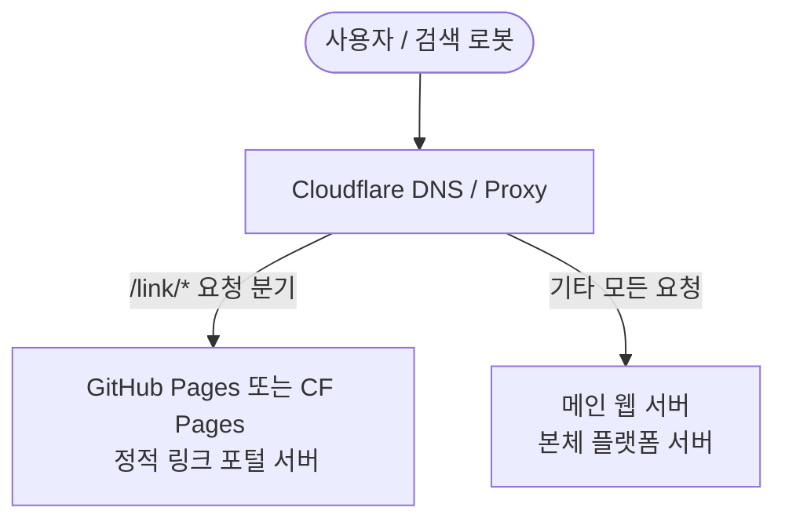

# Kori Care - 서브디렉토리(/link) 프록시 라우팅 및 배포 가이드

본 문서는 메인 서비스(`koricare.kr`)와 가벼운 링크 포털(`koricare.kr/link`)을 서로 다른 호스팅 환경에서 물리적으로 분리 운영하되, 사용자 및 검색 엔진(SEO)에게는 완벽한 단일 도메인 서브디렉토리 구조로 보이기 위한 **Cloudflare Workers 리버스 프록시(Reverse Proxy) 설정 가이드**입니다.

---

## 🏛️ 1. 아키텍처 개요



*   **메인 도메인:** `koricare.kr` (또는 `www.koricare.kr`)
*   **링크 포털 물리 서버:** GitHub Pages (`https://[대표님깃허브ID].github.io/link`) 또는 Cloudflare Pages에 배포.
*   **목적:** 검색 엔진 최적화(SEO) 점수 누수 없이 `koricare.kr/link` 주소로 링크 포털을 매끄럽게 연결.

---

## 🛠️ 2. Cloudflare Workers 프록시 설정 단계

이 작업을 적용하려면 대표님의 `koricare.kr` 도메인이 **Cloudflare 네임서버에 등록 및 연결(Proxied)**되어 있어야 합니다.

### Step 1. Cloudflare Worker 생성
1. Cloudflare 대시보드 로그인 ➔ **Workers & Pages** 메뉴로 이동합니다.
2. **Create Application** (애플리케이션 생성) ➔ **Create Worker** (Worker 생성) 버튼을 누릅니다.
3. Worker의 이름을 입력합니다. (예: `koricare-routing-proxy`)
4. **Deploy**를 눌러 기본 Worker를 배포합니다.

### Step 2. Worker 스크립트 작성 및 배포
생성된 Worker의 **Quick Edit**을 누르고 아래의 자바스크립트 코드를 복사하여 그대로 붙여넣은 뒤, **Save and Deploy**를 클릭합니다.

```javascript
/**
 * Kori Care - Subdirectory Routing Proxy (Cloudflare Worker)
 */
addEventListener('fetch', event => {
  event.respondWith(handleRequest(event.request))
})

async function handleRequest(request) {
  const url = new URL(request.url)
  
  // 1. 만약 요청 경로가 /link 로 시작하는 경우 (포털 분기)
  if (url.pathname === '/link' || url.pathname.startsWith('/link/')) {
    
    // [설정] 링크 포털이 실제 배포된 GitHub Pages 주소를 입력하세요.
    // 깃허브 저장소 이름이 'link'라고 가정합니다.
    const GIT_PAGES_HOST = "your-github-username.github.io";
    
    const targetUrl = new URL(request.url);
    targetUrl.hostname = GIT_PAGES_HOST;
    targetUrl.protocol = 'https:';
    targetUrl.port = ''; // 포트 초기화
    
    // 만약 호스트 이름 변경 시 헤더 변조가 필요하므로 헤더 설정 재조립
    const modifiedHeaders = new Headers(request.headers);
    modifiedHeaders.set("Host", GIT_PAGES_HOST);
    
    const modifiedRequest = new Request(targetUrl, {
      method: request.method,
      headers: modifiedHeaders,
      body: request.body,
      redirect: 'manual'
    });
    
    try {
      let response = await fetch(modifiedRequest);
      
      // 브라우저 캐시 방지 및 CORS 헤더 보안 처리 등 필요 시 가공 가능
      return response;
    } catch (e) {
      return new Response("Kori Care Link Portal is temporarily unavailable.", { 
        status: 502, 
        headers: { "Content-Type": "text/plain; charset=utf-8" } 
      });
    }
  }
  
  // 2. 그 외 모든 요청 (/link가 아닌 메인 서비스 요청)
  // Cloudflare가 원래 등록된 메인 웹 서버(Origin)로 트래픽을 통과시킵니다.
  return fetch(request);
}
```

### Step 3. 라우팅 규칙(Routes) 바인딩
작성한 Worker가 도메인 주소로 인입되는 트래픽을 감시하도록 라우터 경로를 지정해야 합니다.

1. Cloudflare 대시보드 ➔ **Workers & Pages** ➔ 생성한 Worker 상세 화면 ➔ **Triggers** (트리거) 탭으로 이동합니다.
2. **Routes** 섹션에서 **Add Route** (경로 추가)를 누릅니다.
3. 아래와 같이 두 개의 경로를 추가하고, 생성한 Worker와 연동합니다.
   *   `koricare.kr/*` (루트 도메인 트래픽 감시)
   *   `www.koricare.kr/*` (www 도메인 트래픽 감시)
4. 저장(Save)합니다.

---

## 📢 3. 배포 시 주의사항 (SEO 및 보안)
*   **깃허브 저장소(Custom Domain) 설정 해제:** 이 Worker 프록시 방식을 사용할 경우, 깃허브 Pages 설정창 내의 **Custom Domain 항목은 절대 입력하지 마십시오(비워두셔야 합니다).** 깃허브 측에 도메인을 묶어버리면 프록시 요청 헤더와 충돌하여 404/SSL 인증 오류가 발생할 수 있습니다. 깃허브 Pages는 기본 주소인 `[username].github.io/link`로만 열려 있으면 되며, Cloudflare가 이를 뒤에서 조용히 긁어와 서빙합니다.
*   **메인 서버 등록:** Cloudflare DNS 메뉴에 메인 웹 서버(A 레코드 등)가 정상적으로 등록 및 구동되고 있어야 합니다. 그래야 `/link` 이외의 요청이 메인 서버로 안전하게 통과됩니다.

---

## 🔗 4. 보조 도메인(co.kr) ➔ 메인 도메인(kr) 301 포워딩 설정

`koricare.co.kr` 도메인 활성화가 완료되면, 해당 도메인으로 유입되는 모든 사용자와 검색 로봇을 메인 도메인인 `koricare.kr`로 자동 강제 이동시키는 **301 영구 리디렉션(301 Permanent Redirect)**을 세팅해야 합니다.

### 설정 방법 (클라우드플레어 최신 Redirect Rules 활용)
1. Cloudflare 대시보드 로그인 ➔ **koricare.co.kr** 사이트를 클릭하여 진입합니다.
2. 좌측 메뉴에서 **Rules (규칙)** ➔ **Redirect Rules (리디렉션 규칙)**를 선택합니다.
3. **Create Rule (규칙 생성)** 파란색 버튼을 클릭합니다.
4. 규칙의 기본 정보를 아래와 같이 입력합니다:
   *   **Rule name (규칙 이름):** `Redirect co.kr to kr`
   *   **If incoming requests match (조건):** `All incoming requests` (모든 인입 요청) 선택
5. **Then (실행할 작업)** 설정:
   *   **Type (유형):** **`Dynamic` (동적)** 선택 (매우 중요)
   *   **Expression (표현식):** 아래 코드를 그대로 복사해서 붙여넣습니다.
       ```text
       concat("https://koricare.kr", http.request.uri.path)
       ```
   *   **Status code (상태 코드):** **`301` (Moved Permanently)** 선택
   *   **Preserve query string (쿼리 스트링 유지):** 체크 활성화 (선택 사항)
6. 우측 하단의 **Deploy (배포)** 버튼을 누릅니다.

### 🌟 이 방식의 효과
이 설정을 마치면 사용자가 `koricare.co.kr/link/news/123` 등 어느 상세 경로로 접속하더라도 자동으로 `https://koricare.kr/link/news/123`이라는 **동일한 메인 주소 경로로 매끄럽게 포워딩**되며, 네이버와 구글의 검색 랭킹 점수를 손실 없이 보존하게 됩니다.

